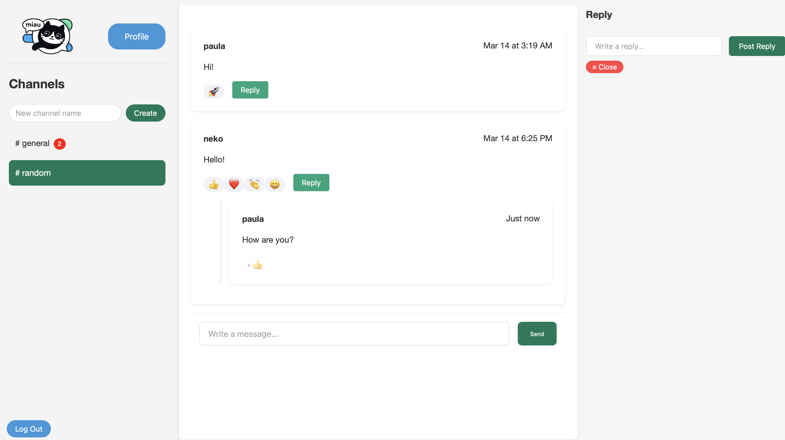

# Miau - A Slack Dupe

Here we have a real-time messaging platform inspired by Slack, built with Flask (Python) backend and React frontend.

## Features

### Core Functionality
- **Channels**: Public chat rooms for group conversations
- **Messages**: Real-time messaging with threading support
- **Replies**: Threaded responses to messages
- **Reactions**: Emoji reactions to messages
- **User Authentication**: Secure signup/login with password management

### Key Technical Features
- Real-time updates using polling intervals
- Responsive design for all screen sizes
- SQLite database with migration support
- RESTful API endpoints
- Session-based authentication
- Unread message tracking
- Image URL parsing in messages
- Navigation history support

## Technologies Used

**Backend**
- Python 3.11+
- Flask
- SQLite3
- Flask-Migrate

**Frontend**
- React 18.2
- React Router 6.20
- Axios 1.6

## Installation

### Prerequisites
- Python 3.11+
- Node.js v20+
- npm

### Setup

1. **Clone the repository**

git clone https://github.com/paula-cadena/slack-dupe.git

cd slack-dupe

2. **Set up Backend**

pip3 install -r requirements.txt

cd server

flask db upgrade

3. **Set up Frontend**

cd ../client

npm install

### Running the application

1. **Start Backend Server**

cd server

flask run

2. **Start Frontend**

cd ../client

npm start

The application will be available at http://localhost:3000
